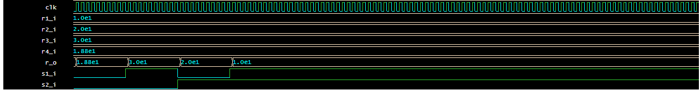

Real Switch

### Description
Multi/demultiplexor

| **Switches combination** | **Displayed speed** |
| :-: | :-: |
| 00 | Average speed |
| 01 | Speed of section 1 |
| 10 | Speed of section 2 |
| 11 | Speed of section 3 |
