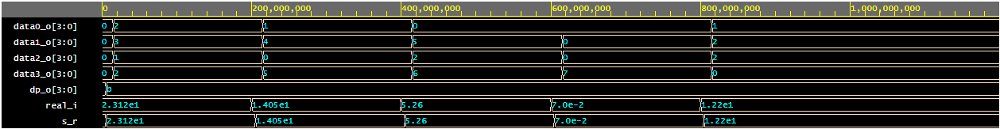

### Description
cz 
Tento modul - převod z reálného čísla na hexadecimální je důležitý, protože hardware deska nedokáže přijmout kód s reálným číslem. Algoritmus funguje tak a tak absolutně nechápu. 

